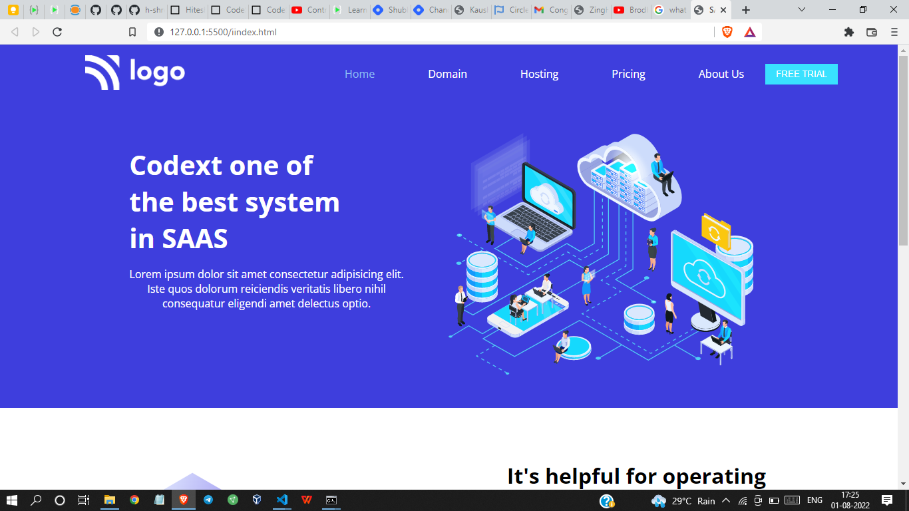

# Project 13 - HTML  and CSS 

By Shreesha

Here's the Live Deployed Website of 

## Project 13  [DEPLOYED LINK](https://project13-saas-lading-page.netlify.app/)

# What did I learn in this project

- I got to learn beautifying of buttons.
- I got to learn about the positioning of containers. 
- Got to learn about the flexbox.

## Time taken to complete project is 2 hours
